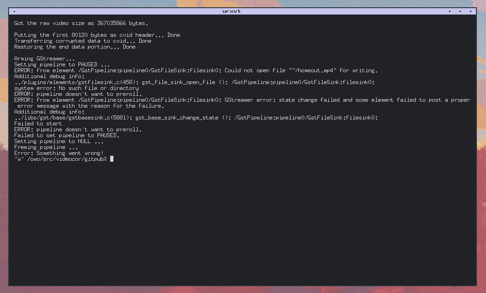

# Bugs? There are plenty.
(should be at least)

## Path fails
- Command: ./corruptor.sh -i=../devspace/video.mp4 -o=~/homeout ...
- Why?: This script doesn't understand relative paths with a tilda in the name. Fixing this will result in other bugs regarding filenames.

- Fix: Use `$HOME` instead of `~`

## GStreamer freeze
- Command: any
- Why?: Random issues with the encoder/muxer
- Fix: Try different -g settings

## Other GStreamer errors
- Command: any
- Why?: Missing encoder, broken video headers, etc.
- Fix: Install all gst plugin packages, most importantly gst-plugins-ugly / Try different switches
