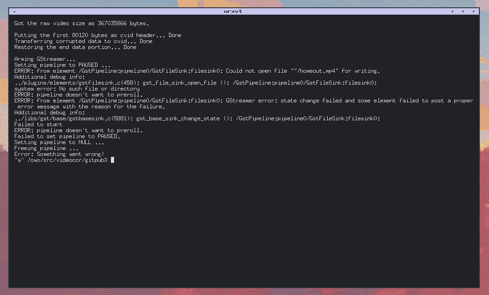

# Bugs? There are plenty.
(should be at least)

## GStreamer export fail
- Command: ./corruptor.sh -i=../devspace/video.mp4 -o=~/homeout -f=lowpass -s=5000
- Why?: This script doesn't understand relative paths with a tilda in the name. Fixing this will result in other bugs regarding filenames.

- Fix: Use `$HOME` instead of `~`
